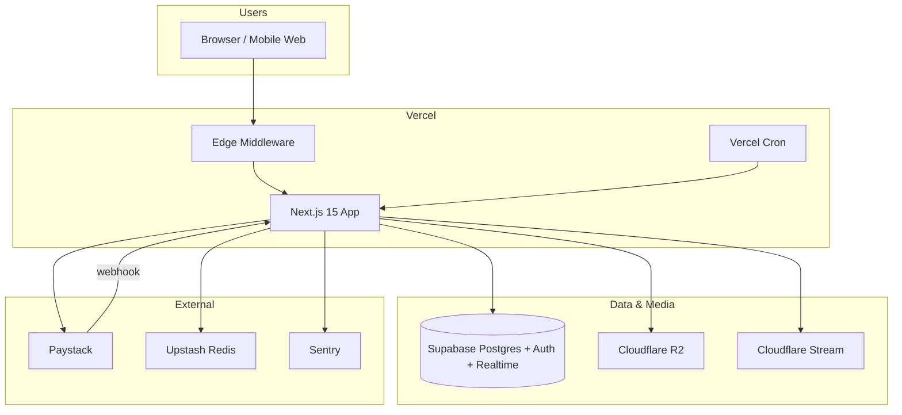

# Fanbase NG — Production Deployment Plan

**Stack:** Vercel · Supabase · Cloudflare R2 · Cloudflare Stream · Paystack  
**Target region:** Vercel (iad1 or closest to Nigeria users) · Supabase (eu-west-1 or AWS region with low latency to NG)

---

## 1. Architecture overview



| Component | Role |
|-----------|------|
| **Vercel** | Hosting, preview deploys, crons, env secrets |
| **Supabase** | Auth, Postgres, RLS, Realtime (notifications), storage buckets (legacy paths) |
| **R2** | Private post/message/profile object storage (presigned uploads) |
| **Stream** | Video upload + playback |
| **Paystack** | Checkout, subscriptions, webhooks, payouts (manual/API later) |
| **Upstash** | Distributed rate limiting (required for multi-instance Vercel) |

---

## 2. Environment variables

### 2.1 Vercel environments

Configure three scopes in **Vercel → Project → Settings → Environment Variables**:

| Scope | Purpose |
|-------|---------|
| **Development** | Local `vercel dev` (optional) |
| **Preview** | PR branches — use **test** Paystack keys, staging Supabase optional |
| **Production** | Live traffic — live keys only |

### 2.2 Variable matrix

| Variable | Preview | Production | Exposure | Notes |
|----------|---------|------------|----------|-------|
| `NEXT_PUBLIC_APP_URL` | `https://<preview>.vercel.app` or staging domain | `https://fanbase.ng` (prod URL) | Public | Must match deployed origin for CSRF/origin checks |
| `NEXT_PUBLIC_SUPABASE_URL` | Staging project URL | Prod project URL | Public | Separate Supabase projects strongly recommended |
| `NEXT_PUBLIC_SUPABASE_ANON_KEY` | Staging anon key | Prod anon key | Public | RLS protects data |
| `SUPABASE_SERVICE_ROLE_KEY` | Staging service role | Prod service role | **Secret** | Server/cron/webhooks only; never `NEXT_PUBLIC_` |
| `NEXT_PUBLIC_PAYSTACK_PUBLIC_KEY` | `pk_test_...` | `pk_live_...` | Public | |
| `PAYSTACK_SECRET_KEY` | `sk_test_...` | `sk_live_...` | **Secret** | Webhook signature verification |
| `R2_ACCOUNT_ID` | Same or dev bucket account | Prod account | **Secret** | |
| `R2_ACCESS_KEY_ID` | R2 API token | Prod token | **Secret** | Scoped to bucket read/write |
| `R2_SECRET_ACCESS_KEY` | R2 secret | Prod secret | **Secret** | |
| `R2_BUCKET_NAME` | e.g. `fanbase-media-staging` | e.g. `fanbase-media-prod` | **Secret** | Separate buckets per env |
| `CLOUDFLARE_ACCOUNT_ID` | Account ID | Account ID | **Secret** | |
| `CLOUDFLARE_STREAM_API_TOKEN` | Stream token (staging) | Stream token (prod) | **Secret** | Minimum permissions: Stream Edit |
| `CLOUDFLARE_STREAM_CUSTOMER_CODE` | Optional | Customer subdomain code | **Secret** | For signed playback URLs |
| `MEDIA_WEBHOOK_SECRET` | Random 32+ chars | **New** random 32+ chars | **Secret** | Virus-scan callback header `x-media-webhook-secret` |
| `VIRUS_SCAN_WEBHOOK_URL` | Scanner URL or empty | Production scanner | **Secret** | Empty = scan skipped/async per `VIRUS_SCAN_MODE` |
| `VIRUS_SCAN_MODE` | `off` or `async` | `async` or `required` | **Secret** | `required` blocks publish until scan completes |
| `CRON_SECRET` | Random 32+ chars | **New** random 32+ chars | **Secret** | `Authorization: Bearer <CRON_SECRET>` for `/api/internal/*` |
| `UPSTASH_REDIS_REST_URL` | Upstash REST URL | Upstash REST URL | **Secret** | Required for production rate limits |
| `UPSTASH_REDIS_REST_TOKEN` | Upstash token | Upstash token | **Secret** | |
| `WALLET_ENCRYPTION_KEY` | 32+ char secret | **Unique** 32+ char secret | **Secret** | Payout account encryption; **do not rotate** without migration |
| `SENTRY_DSN` | Optional | Production DSN | **Secret** | Error tracking (recommended) |

### 2.3 Boot-time validation

On **Vercel Production** (`VERCEL_ENV=production`), `instrumentation.ts` calls `validateProductionEnv()` and **fails deploy** if missing:

- `SUPABASE_SERVICE_ROLE_KEY`
- `CRON_SECRET` (min 16 characters)
- `PAYSTACK_SECRET_KEY`
- `MEDIA_WEBHOOK_SECRET` (min 16 characters)
- `WALLET_ENCRYPTION_KEY` (min 32 characters)

### 2.4 Generating secrets

```bash
# CRON_SECRET, MEDIA_WEBHOOK_SECRET (32 bytes hex = 64 chars)
openssl rand -hex 32

# WALLET_ENCRYPTION_KEY (44-char base64 ≈ 32 bytes)
openssl rand -base64 32
```

Store secrets in **1Password / Vault**; map into Vercel only.

### 2.5 Template file

Copy [`.env.production.example`](../../.env.production.example) for a checklist (do not commit filled values).

---

## 3. Pre-production checklist

### 3.1 Supabase (production project)

1. Create dedicated **production** project (do not share with dev).
2. Enable **Point-in-Time Recovery (PITR)** on Pro plan or higher.
3. Run migrations in order:

   ```bash
   supabase link --project-ref <PROD_REF>
   supabase db push
   ```

   See [supabase/README.md](../../supabase/README.md) (38 migrations in `supabase/migrations/`).

4. **Auth → URL configuration**
   - Site URL: `https://<production-domain>`
   - Redirect URLs: `https://<production-domain>/callback`, `https://<production-domain>/reset-password`

5. **Auth → Email** — configure SMTP (Resend, SendGrid, etc.) for production deliverability.

6. Create first **staff admin**: insert into `admin_users` linking a `profiles.id` with role `admin` or `super_admin`.

7. Enable **Realtime** for `notifications` (migration already adds publication).

### 3.2 Cloudflare R2

1. Create bucket (e.g. `fanbase-media-prod`), **block public access**.
2. Create API token: Object Read & Write on that bucket only.
3. CORS (if needed for direct browser PUT to presigned URLs):

   ```json
   [
     {
       "AllowedOrigins": ["https://<production-domain>"],
       "AllowedMethods": ["GET", "PUT", "HEAD"],
       "AllowedHeaders": ["*"],
       "MaxAgeSeconds": 3600
     }
   ]
   ```

### 3.3 Cloudflare Stream

1. Create API token with Stream permissions.
2. Configure **webhook** (optional): `https://<production-domain>/api/v1/media/webhooks/stream` with shared secret pattern used by your Stream integration.
3. Set `CLOUDFLARE_STREAM_CUSTOMER_CODE` if using signed playback.

### 3.4 Paystack (live)

1. Complete business verification; switch to **live** keys on production only.
2. **Webhooks** → Add URL:  
   `https://<production-domain>/api/v1/webhooks/paystack`
3. Events (minimum): `charge.success`, `charge.failed`, `refund.processed`, `refund.failed`, `subscription.create`, `subscription.disable`, `subscription.not_renew`, `invoice.payment_failed`
4. Copy **secret key** into `PAYSTACK_SECRET_KEY` (used for HMAC verification).

### 3.5 Vercel

1. Import Git repo; set **Production Branch** = `main`.
2. Framework: Next.js; build: `npm run build`; install: `npm ci`.
3. Add all production env vars (section 2).
4. Attach custom domain; enable HTTPS (automatic).
5. **Crons** — `vercel.json` already defines four jobs; ensure project is on a plan that supports crons and `CRON_SECRET` is set (Vercel sends `Authorization: Bearer` when configured in dashboard for cron, or use Vercel Cron secret header — verify Vercel sends header your middleware expects).

   Middleware expects: `Authorization: Bearer ${CRON_SECRET}`.

6. Configure **Vercel → Cron Jobs** to pass `Authorization` header with `CRON_SECRET` if not automatic.

### 3.6 Upstash

1. Create Redis database (region near Vercel deployment).
2. Add `UPSTASH_REDIS_REST_URL` and `UPSTASH_REDIS_REST_TOKEN` to production.

---

## 4. CI/CD pipeline

### 4.1 Branch strategy

| Branch | Vercel | Supabase | Paystack |
|--------|--------|----------|----------|
| `main` | Production | Prod (manual migrate) | Live |
| `develop` (optional) | Staging alias | Staging | Test |
| PR branches | Preview | Staging or none | Test |

### 4.2 GitHub Actions (implemented)

Workflow: [`.github/workflows/ci-cd.yml`](../../.github/workflows/ci-cd.yml)

```text
PR / push to main
  ├── quality: lint, typecheck, test:coverage
  └── e2e: Playwright (CI build)

push to main (after quality)
  └── deploy-hint: summary + optional Supabase migration job (manual approval)

Tag v*.*.*
  └── release notes template (optional)
```

**Vercel deployment** is triggered by **Vercel Git integration** (recommended):

- PR → Preview deployment (automatic)
- Merge to `main` → Production deployment (automatic after checks pass)

Enable **Vercel → Git → Required checks**: `quality`, `e2e` (or `unit` only if E2E flaky without Supabase).

### 4.3 Database migrations in CI/CD

**Recommended:** separate, gated job — do not auto-push migrations on every app deploy.

| Step | Actor | Action |
|------|--------|--------|
| 1 | Developer | PR includes SQL migration in `supabase/migrations/` |
| 2 | CI | Review + merge after `quality` passes |
| 3 | Release engineer | `supabase db push` against **staging**, smoke test |
| 4 | Release engineer | `supabase db push` against **production** (maintenance window if breaking) |
| 5 | Vercel | Deploy app **after** migration succeeds |

GitHub secrets for optional automated migration job:

| Secret | Purpose |
|--------|---------|
| `SUPABASE_ACCESS_TOKEN` | Supabase CLI login |
| `SUPABASE_PROD_PROJECT_REF` | Production project ref |
| `SUPABASE_DB_PASSWORD` | Direct DB password (if using db push with password) |

Use **Supabase GitHub Integration** or manual CLI — avoid storing service role in CI logs.

### 4.4 Rollback

| Layer | Rollback |
|-------|----------|
| **App** | Vercel → Deployments → Promote previous deployment (instant) |
| **Database** | PITR restore to timestamp (Supabase dashboard) — **data loss** after restore point |
| **R2/Stream** | Object versioning / retain deleted keys 30d (see backup) |
| **Paystack** | Cannot rollback charges; use refund flow in dashboard/API |

---

## 5. Backup strategy

### 5.1 Supabase Postgres

| Method | Frequency | Retention | Owner |
|--------|-----------|-----------|-------|
| **Automated daily backups** | Daily (Supabase managed) | Per plan (7–30 days) | Supabase |
| **PITR** | Continuous WAL | 7+ days (Pro) | Supabase |
| **Logical dump** | Weekly | 90 days offsite | You |

Weekly logical backup (run from secure CI or ops machine):

```bash
supabase db dump --project-ref <PROD_REF> -f "fanbase-prod-$(date +%Y%m%d).sql"
```

Store encrypted in **S3 / R2 archive bucket** with versioning; restrict IAM to ops role.

**Auth users:** `supabase db dump` includes auth schema on paid plans; verify restore procedure in staging annually.

### 5.2 Cloudflare R2

| Method | Frequency | Retention |
|--------|-----------|-----------|
| **Bucket versioning** | Enable on prod bucket | 30 days |
| **Lifecycle rule** | Transition to Infrequent Access / delete old versions | 90 days max |
| **Cross-region replication** (optional) | Real-time or daily | DR copy |

Critical objects: post media, message attachments, profile assets referenced by `media_uploads.object_key`.

### 5.3 Cloudflare Stream

- Stream retains videos per account policy; export **UID list** weekly from `media_uploads` where `provider = 'stream'`.
- For legal/compliance: use [Stream API](https://developers.cloudflare.com/stream/) to download masters for top creators if required.

### 5.4 Application config

| Asset | Backup |
|-------|--------|
| Vercel env vars | Export screenshot + 1Password vault |
| Paystack keys | Paystack dashboard (rotate if leaked) |
| `WALLET_ENCRYPTION_KEY` | **Backup once** in HSM/vault — loss = cannot decrypt payout accounts |

### 5.5 What is not backed up by default

- Upstash Redis (ephemeral rate-limit counters — acceptable)
- Vercel build artifacts (rebuilt from git)
- In-flight `pending` payments — reconcile via Paystack dashboard + `payments` table

---

## 6. Disaster recovery plan

### 6.1 Scenarios

| ID | Scenario | RTO | RPO | Procedure |
|----|----------|-----|-----|-----------|
| DR-1 | Vercel region outage | 30 min | 0 | Promote redeploy to alternate region if using multi-region; or wait for Vercel |
| DR-2 | Bad production deploy | 5 min | 0 | Vercel instant rollback |
| DR-3 | Supabase region failure | 4–24 h | 1 h–24 h | Supabase status page; PITR to new project or wait; update env URLs |
| DR-4 | Accidental data delete | 2–4 h | 5 min–1 h | PITR restore to pre-delete timestamp; validate in staging clone first |
| DR-5 | R2 bucket deletion | 4–8 h | 24 h | Restore from versioning / replica bucket |
| DR-6 | Paystack webhook outage | 1 h | 0 | Queue events in Paystack; run `subscription-reconcile` cron; manual `POST /api/v1/payments/verify` |
| DR-7 | Leaked service role key | 2 h | — | Rotate Supabase service role; redeploy Vercel; audit `audit_logs` |
| DR-8 | `WALLET_ENCRYPTION_KEY` lost | — | — | **Unrecoverable** payout account numbers; prevent via vault backup |

**RTO** = Recovery Time Objective · **RPO** = Recovery Point Objective

### 6.2 DR runbook (high level)

1. **Declare incident** — assign IC, comms channel, status page.
2. **Assess blast radius** — app only vs DB vs payments.
3. **Stabilize**
   - App: Vercel rollback
   - Payments: pause checkout (feature flag or Paystack maintenance mode message)
   - DB: stop writes if corruption suspected
4. **Recover data** — Supabase PITR → new project → update `NEXT_PUBLIC_SUPABASE_*` + `SUPABASE_SERVICE_ROLE_KEY` on Vercel → redeploy
5. **Verify**
   - `GET /api/ready` → `status: ready`
   - Login, feed, subscribe (test account), webhook replay from Paystack
6. **Post-incident** — audit log review, customer comms, patch root cause

### 6.3 Annual DR drill

- Restore staging from production PITR snapshot.
- Run full migration set on empty project.
- Execute E2E smoke suite against restored staging.

---

## 7. Monitoring setup

### 7.1 Uptime (synthetic)

| Check | URL | Interval | Alert |
|-------|-----|----------|-------|
| Liveness | `GET /api/health` | 1 min | Pager if 2 failures |
| Readiness | `GET /api/ready` | 5 min | Pager if `degraded` 3x |
| Home | `GET /` | 5 min | Warning |
| Paystack webhook | Manual synthetic charge in staging | Daily | — |

Tools: Better Uptime, Checkly, or UptimeRobot.

### 7.2 Vercel

Enable **Vercel Observability** (Pro):

- Function error rate, duration p95
- Cron execution failures (alert on failed invocations)

**Alerts:**

- Error rate > 2% for 5 min
- p95 latency > 3s on `/api/v1/feed`
- Cron job failure (any of 4 paths)

### 7.3 Supabase

Dashboard + email alerts:

- CPU > 80% sustained
- Disk > 85%
- Replication lag (if used)
- Auth rate limit spikes

Enable **Log Explorer** for slow queries (> 1s).

### 7.4 Sentry (recommended)

1. Create Sentry project (Next.js).
2. Set `SENTRY_DSN` in Vercel production.
3. Install `@sentry/nextjs` (see Phase 2 in [13-production-phase1.md](../increments/13-production-phase1.md)).
4. Alerts:
   - New issue in `production` > 10 events / 5 min
   - Payment webhook processing failures
   - `FeedUnavailableError`

### 7.5 Business metrics (dashboard)

Weekly review SQL / admin dashboard:

| Metric | Source |
|--------|--------|
| Failed payments (24h) | `payments` where `status = 'failed'` |
| Pending moderation | `admin_get_dashboard_stats` |
| Open reports | `reports` |
| Webhook backlog | `paystack_webhook_events` unprocessed |
| Stuck uploads | `media_uploads` where `status = 'pending_upload'` and `expires_at < now()` |

### 7.6 Paystack

- Dashboard alerts for dispute rate, charge failure rate.
- Webhook delivery failures → fix URL/signature immediately.

### 7.7 Cloudflare

- R2 request errors / 5xx
- Stream encoding failures (dashboard)

---

## 8. Logging setup

### 8.1 Current state

- Structured JSON via `lib/logger.ts` (`console.log` / `console.error`)
- Request correlation: `x-request-id` header (middleware)
- Audit trail: `audit_logs` table (payments, admin, media) — **compliance**, not ops search

### 8.2 Vercel log drain (production)

1. **Vercel → Project → Logs → Log Drain**
2. Destination options:
   - **Axiom** (recommended for Vercel)
   - **Datadog**
   - **Better Stack (Logtail)**

3. Parse JSON lines; index fields: `level`, `msg`, `requestId`, `error`.

### 8.3 Required log fields (convention)

When adding logs, include:

```json
{
  "level": "error",
  "msg": "paystack.webhook.failed",
  "requestId": "uuid",
  "route": "/api/v1/webhooks/paystack",
  "error": "message",
  "entityId": "optional-uuid"
}
```

**Never log:** `PAYSTACK_SECRET_KEY`, `SUPABASE_SERVICE_ROLE_KEY`, presigned URLs, `WALLET_ENCRYPTION_KEY`, raw card data.

### 8.4 Retention

| Store | Retention |
|-------|-----------|
| Vercel runtime logs | 1–7 days (plan-dependent) |
| Log drain | 30–90 days |
| `audit_logs` (Postgres) | Indefinite (partitioned); archive old partitions yearly |
| Sentry | 90 days default |

### 8.5 Alerts from logs

| Query / condition | Action |
|-------------------|--------|
| `msg:paystack.webhook.signature_rejected` | Security review |
| `msg:feed.get_ranked_home_feed_failed` | DB/RPC outage |
| `msg:ready.supabase_failed` | DB connectivity |
| `level:error` rate spike | Page on-call |

### 8.6 Supabase logs

Enable Postgres slow-query log; ship to same log drain if Supabase integration available.

---

## 9. Production launch sequence

| Order | Task | Owner |
|-------|------|-------|
| 1 | Prod Supabase + migrations | Backend |
| 2 | R2 + Stream buckets/tokens | Infra |
| 3 | Paystack live webhooks (test charge) | Payments |
| 4 | Vercel prod env + domain | Infra |
| 5 | Upstash + Sentry + log drain | Infra |
| 6 | Uptime monitors | Infra |
| 7 | Staff admin account | Ops |
| 8 | Smoke test checklist (auth, sub, PPV, post, cron) | QA |
| 9 | Go-live + watch dashboards 24h | All |

### Smoke test checklist

- [ ] Sign up → verify email → login
- [ ] Creator profile + publish post (image)
- [ ] Fan subscribe (Paystack test/live small amount)
- [ ] PPV unlock
- [ ] Notification received (Realtime)
- [ ] `/api/health` + `/api/ready` green
- [ ] Cron: publish-scheduled-posts (check Vercel cron logs)
- [ ] Paystack webhook received (`audit_logs` / `paystack_webhook_events`)

---

## 10. Related docs

- [Testing](../testing.md)
- [Production Phase 1](../increments/13-production-phase1.md)
- [Supabase migrations](../../supabase/README.md)
- [Secure media](../increments/09-secure-media.md)
- [Paystack](../increments/05-paystack.md)
