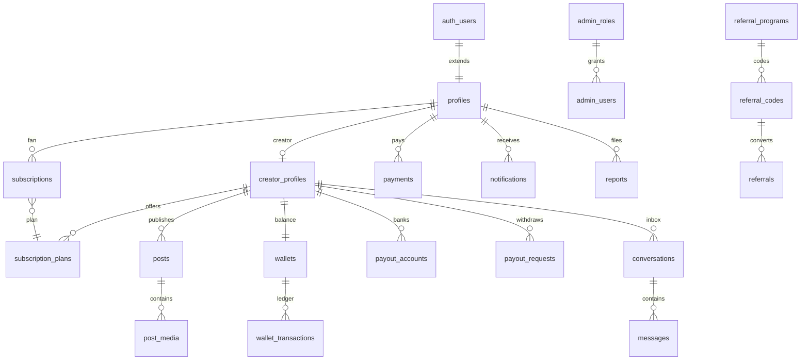

# PostgreSQL schema reference

Production DDL: `supabase/migrations/20250602120000_production_schema.sql`

## Entity map

## Tables (37)

| Domain | Tables |
|--------|--------|
| **Users** | `profiles`, `user_sessions` |
| **Creators** | `creator_profiles` |
| **Subscriptions** | `subscription_plans`, `subscriptions`, `subscription_events` |
| **Content** | `posts`, `post_media`, `post_likes`, `post_comments`, `post_views`, `ppv_purchases`, `tips` |
| **Messaging** | `conversations`, `messages`, `message_purchases` |
| **Payments** | `payments`, `disputes` |
| **Wallets** | `wallets`, `wallet_transactions` |
| **Payouts** | `payout_accounts`, `payout_requests` |
| **Notifications** | `notifications`, `notification_preferences` |
| **Moderation** | `reports`, `moderation_queue`, `moderation_actions`, `user_strikes` |
| **Admin** | `admin_roles`, `admin_users` |
| **Referrals** | `referral_programs`, `referral_codes`, `referrals`, `referral_rewards` |
| **Ops** | `audit_logs`, `earnings_daily` |

## Scale optimizations

| Technique | Applied to |
|-----------|------------|
| **Range partitioning (monthly)** | `messages`, `wallet_transactions`, `notifications`, `audit_logs`, `post_views` |
| **Partial indexes** | Active subscriptions, open reports, pending moderation, unread notifications |
| **Composite indexes** | Inbox sort keys, creator feeds, ledger history |
| **GIN / full-text** | `profiles.search_vector`, `posts.search_vector`, `creator_profiles.category` |
| **BIGINT money** | All `*_kobo` columns |
| **Idempotency** | `payments.paystack_reference`, `wallet_transactions.idempotency_key` |
| **Append-only ledger** | `wallet_transactions` (no UPDATE/DELETE policies) |
| **Generated columns** | Search vectors on profiles/posts |

## Key constraints

- One active subscription per `(fan_id, creator_id)` — partial unique index
- One wallet per `(owner_id, owner_type)`
- One referral per referee — `uq_referrals_referee`
- PPV: one purchase per `(fan_id, post_id)`
- Username: `^[a-z0-9_]{3,30}$`, unique among non-deleted users

## Admin vs platform users

- **Fans/creators:** `auth.users` → `profiles`
- **Staff:** `admin_users` (email + `admin_roles`) — not mixed with creator auth in production

## Money flow

1. `payments` — Paystack webhook (gross)
2. `wallet_transactions` — fee splits + creator credit (pending → available via `clears_at`)
3. `payout_requests` — debit wallet, Paystack Transfer

## Not in v1 DDL (add via later migration)

- Materialized view for fan feed fan-out
- `pg_cron` job definitions (platform-specific)
- Column-level encryption keys for `account_number_encrypted` (use Supabase Vault / app-layer AES)
